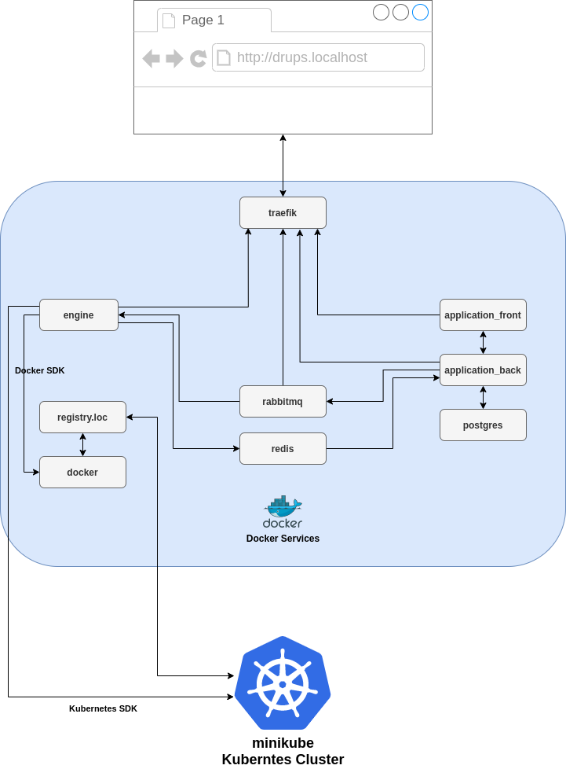

# What is Drups.io Docker

Drups.io Docker is a development environment for Drups.io Dev and DevOps teams. It creates production-similar
environment for developing [Drups.io Engine](https://drupsio.readthedocs.io/projects/engine) and 
[Drups.io Application](https://drupsio.readthedocs.io/projects/application) using Docker containers and custom building
tools.

## Stack

| Container            | Service name           | Image           |
| -------------------- | ---------------------- | --------------- |
| Engine               | `engine`               | [_/python]      |
| Application Back     | `application_back`     | [_/node]        |
| Application Front    | `application_front`    | [_/node]        |
| RabbitMQ             | `rabbitmq`             | [_/rabbitmq]    |
| Redis                | `redis`                | [_/redis]       |
| Postgres             | `postgres`             | [_/postgres]    |
| Docker               | `docker`               | [_/docker]    |
| Docker Registry      | `registry.loc`         | [_/registry]    |
| Traefik              | `traefik`              | [_/traefik]     |

## Architecture

[_/python]: https://hub.docker.com/_/python
[_/node]: https://hub.docker.com/_/node
[_/rabbitmq]: https://hub.docker.com/_/rabbitmq
[_/redis]: https://hub.docker.com/_/redis
[_/postgres]: https://hub.docker.com/_/postgres
[_/docker]: https://hub.docker.com/_/docker
[_/registry]: https://hub.docker.com/_/registry
[_/traefik]: https://hub.docker.com/_/traefik
